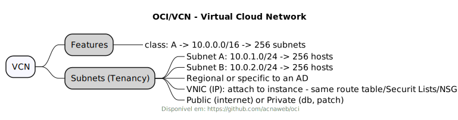
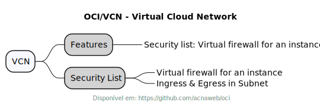
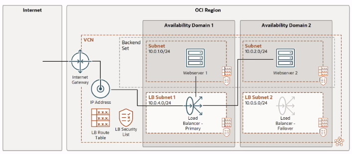

# OCI

Oracle Cloud Infrastructure

## Services

### Compute

#### Mind Map

### VCN (Virtual Cloud Network)

>  Architecture

#### Mind Map

#### Subnet

#### Security List

#### Load Balancer

>  Architecture

#### Mind Map

## References 

- https://oracle.com/cloud
- https://www.udemy.com/course/oracle-cloud-foundations-associate-1z0-1085
- [IP Subnet Calculator](https://www.subnet-calculator.com/subnet.php)
