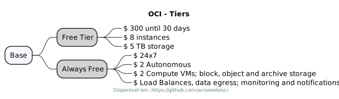

# OCI - Oracle Cloud Infrastructure

## Learning 

OCI Foundations Associate 1Z0-1085-23

> [!IMPORTANT] 
> - [Curso: Oracle CIoud 2023 - OCI Foundations Associate 1Z0-1085-23][1]
> - _Author_: [Kshitij Joy (Oracle Cloud Architect / Oracle ACE Pro)](https://www.linkedin.com/in/kshitij-joy-oracle-cloud-architect-oracle-ace-pro-7ab7bb7/)

## 1. Compute

Compute

## 2. Networking Services

### VCN (Virtual Cloud Network)

Architecture

> [!NOTE]
> Fonte: [Curso: Oracle CIoud 2023 - OCI Foundations Associate 1Z0-1085-23][1]

> [!IMPORTANT]  
> Crucial information necessary for users to succeed.

#### Mind Map

Subnet

Security List

Load Balancer

>  Architecture

> [!NOTE]
> Fonte: [Curso: Oracle CIoud 2023 - OCI Foundations Associate 1Z0-1085-23][1]

#### Mind Map

Customer Connectivity

### Customer Connectivity

>  Architecture

> [!NOTE]
> Fonte: [Curso: Oracle CIoud 2023 - OCI Foundations Associate 1Z0-1085-23][1]

## 3. Database Services

How it's divides?

Autonomous

ExaCC

ExaCS

GoldenGate

MySql

NoSQL

OpenSearch

Oracle Base

## 4. Storage Services

Block Storage

## 5. Security and Compliance

Shared Security Model

Security Services

IAM

## 6. Governance and Administration

Oracle Pricing Model

Free Tier & Always Free

Cost Management

## References 

- https://oracle.com/cloud
- [IP Subnet Calculator](https://www.subnet-calculator.com/subnet.php)

[1]: <https://www.udemy.com/course/oracle-cloud-foundations-associate-1z0-1085> "Oracle CIoud 2023 - OCI Foundations Associate 1Z0-1085-23"