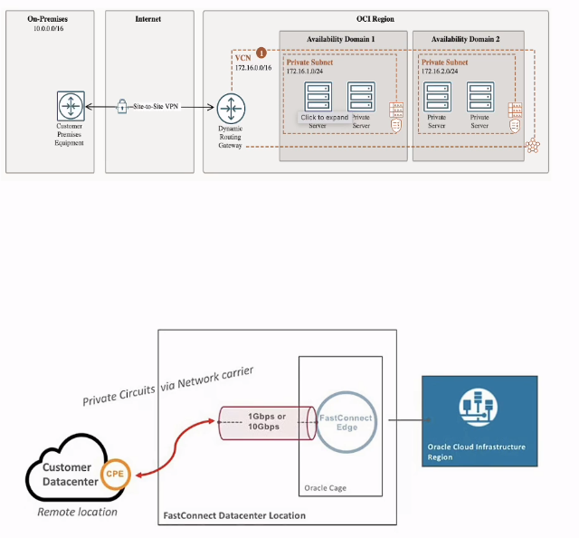

# OCI

Oracle Cloud Infrastructure

## Index

- [1. Compute](#compute)
- [2. Networking Services](#networking-services)

## 1. Compute

#### Mind Map

## 2. Networking Services

### VCN (Virtual Cloud Network)

>  Architecture

#### Mind Map

### Subnet

### Security List

### Load Balancer

>  Architecture

#### Mind Map

### Customer Connectivity

>  Architecture

## 3. Database Services

### How it's divides?

## References 

- https://oracle.com/cloud
- https://www.udemy.com/course/oracle-cloud-foundations-associate-1z0-1085
- [IP Subnet Calculator](https://www.subnet-calculator.com/subnet.php)
